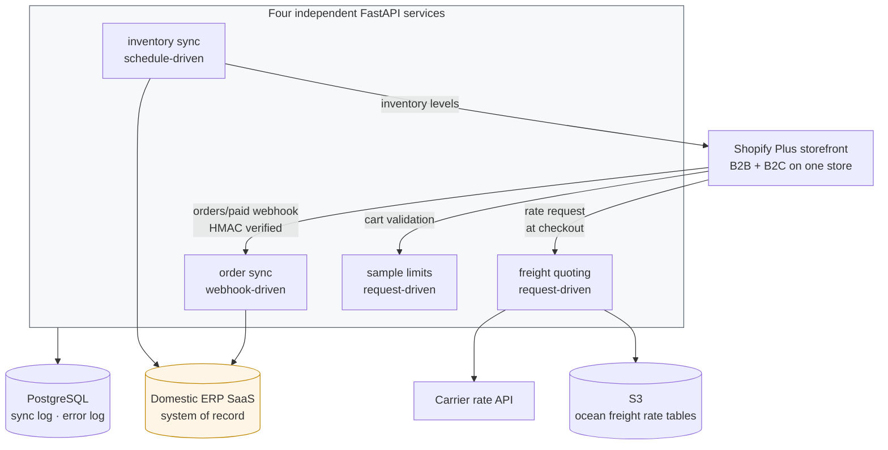

# ERP Integration Patterns

What it takes to put a B2B commerce storefront in front of an ERP that was never designed to have one.

Case studies from a Korean B2B cosmetic-ingredient supplier, whose customers are manufacturers ordering raw materials by the drum — where a single order can weigh a ton and ship by sea, and where the ERP, not the storefront, is the system of record for everything that matters.

These are write-ups, not source. Client code, credentials, and infrastructure identifiers are deliberately absent.

## The shape of the problem

A B2B storefront is not a B2C storefront with different prices. The differences that actually cost engineering time:

| B2C assumption | What B2B required here |
|---|---|
| Shipping is a rate lookup by zone | Freight mode depends on weight — parcel, air, or ocean, with different quoting paths |
| Inventory is authoritative in the store | Inventory is authoritative in the ERP; the store is a projection |
| A customer is a person | A customer is a company with an ERP account code, and the order is worthless without it |
| Anyone can buy anything | Sample quantities are capped per buyer, enforced before checkout |
| Orders are the end state | Orders are an *input* to the ERP, which owns everything downstream |

Every one of those pushes logic out of the platform and into services you operate.

## Architecture

Four services, deliberately split by **trigger** rather than by domain: webhook-driven, request-driven on the purchase path, request-driven on the cart path, and schedule-driven. Services that fail differently and are retried differently should not share a process.

## Cases

| # | Case | Core problem |
|---|---|---|
| 01 | [Order sync into the ERP](cases/01-order-sync-into-erp.md) | The ERP needs a company account code the storefront doesn't have |
| 02 | [Freight quoting across weight tiers](cases/02-freight-quoting-weight-tiers.md) | Quoting ocean freight inside a checkout built for parcels |
| 03 | [Sample purchase limits](cases/03-sample-purchase-limits.md) | Enforcing a per-buyer cap the platform has no concept of |
| 04 | [Scheduled inventory sync](cases/04-scheduled-inventory-sync.md) | Reconciling two stock ledgers twice a day without lying to customers |

## Cross-cutting practices

**Every external call is retried, and every failure is written down.** Retry with backoff via `tenacity`, and errors logged to the database rather than only to stdout — because "the customer says their order never reached the ERP" is a question you answer from a table, not by grepping logs from three weeks ago.

**Sessions to the ERP renew themselves.** The ERP issues short-lived sessions and routes accounts across regional zones. The client resolves its zone and refreshes its session transparently, so no caller has to know either exists.

**Configuration is typed and validated at startup.** Pydantic settings with no defaults on anything required — a missing credential fails at boot with a named field, not at 2am on the first webhook that needs it.

**Webhooks verify HMAC before anything else.** Signature check precedes parsing, always.

## Stack

`Python` · `FastAPI` · `SQLAlchemy` · `Pydantic` · `Alembic` · `PostgreSQL` · `Docker` · `Kubernetes` · `boto3`

---

## 한국어 요약

**스토어프론트가 붙을 거라고는 아무도 생각하지 않고 만든 ERP 앞에 B2B 커머스를 붙인 작업.** 국내 B2B 화장품 원료 공급사 사례입니다. 고객은 원료를 드럼 단위로 사가는 제조사들이고, 주문 하나가 1톤을 넘어 배로 나가기도 합니다. 중요한 것들의 원본은 스토어프론트가 아니라 전부 ERP에 있습니다.

**B2B가 B2C와 다른 지점** (실제로 공수가 든 것들)

| B2C의 전제 | 여기서 필요했던 것 |
|---|---|
| 배송비는 권역별 조회 | 중량에 따라 운송 수단이 갈림 — 택배, 항공, 해상, 각각 견적 경로가 다름 |
| 재고의 원본은 스토어 | 재고 원본은 ERP, 스토어에 보이는 건 그 투영 |
| 고객은 사람 | 고객은 **ERP 거래처 코드를 가진 회사**, 그 코드가 없으면 주문도 쓸모가 없음 |
| 누구나 아무거나 구매 | 샘플은 구매자별 수량 제한을 결제 전에 막아서 적용 |
| 주문이 최종 상태 | 주문은 ERP에 넣는 입력이고, 그 뒤는 전부 ERP가 처리 |

**서비스는 도메인이 아니라 트리거로 나눴습니다.** 웹훅 구동, 구매 경로 요청 구동, 장바구니 요청 구동, 스케줄 구동 네 가지입니다. 장애 나는 방식도 재시도하는 방식도 다른 것들을 한 프로세스에 같이 두지 않으려는 겁니다.

| # | 케이스 | 핵심 문제 |
|---|---|---|
| 01 | ERP 주문 동기화 | 스토어프론트에는 없는 거래처 코드를 ERP가 요구함 |
| 02 | 중량 구간별 운임 견적 | 택배 기준으로 만든 체크아웃 안에서 해상 운임을 견적 |
| 03 | 샘플 구매 제한 | 플랫폼에 개념 자체가 없는 구매자별 상한을 적용 |
| 04 | 스케줄 재고 동기화 | 재고 원장 두 개를 하루 두 번, 고객에게 거짓말하지 않으면서 맞추기 |

**공통 실천**

- 외부 호출은 전부 백오프를 두고 재시도하고(`tenacity`), 실패는 전부 DB에 남깁니다. "주문이 ERP에 안 들어갔다는데요"는 3주 전 로그를 grep해서 답할 질문이 아니라 테이블 하나 조회해서 답할 질문입니다.
- ERP 세션은 알아서 갱신됩니다. ERP가 짧은 세션을 발급하고 계정을 지역 존에 나눠 배치하는데, 클라이언트가 존 판별과 세션 갱신을 처리해서 호출하는 쪽은 둘 다 몰라도 됩니다.
- 설정은 부팅할 때 타입까지 검증합니다. 필수 값에는 기본값을 두지 않아서, 빠지면 첫 웹훅이 들어오는 새벽 2시가 아니라 부팅 시점에 필드명과 함께 죽습니다.
- 웹훅은 파싱보다 HMAC 검증이 먼저입니다.
