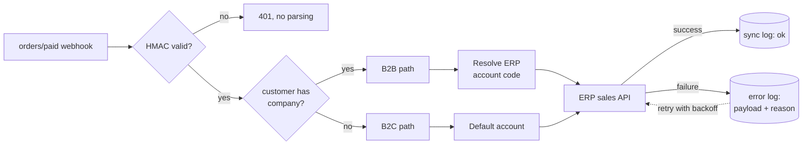

# Order Sync Into the ERP

**Trigger** · Webhook · **Direction** · Storefront → ERP · **Consistency** · At-least-once, idempotent at the ERP boundary

## Context

The ERP is where an order becomes real. Until a sales record exists there, nothing downstream happens — no picking, no invoice, no tax document, no accounts receivable. The storefront is only where the order is *placed*.

So the job is narrow and unforgiving: every paid order must arrive in the ERP exactly once, correctly attributed to the right company account, and any order that doesn't must be visible as a specific failed row rather than an absence.

## Problem

**The ERP identifies customers by an account code the storefront doesn't have.** A B2B buyer in the ERP is a company with a trading account. A buyer on the storefront is a customer record with an email. Nothing in the webhook payload is the ERP's key.

**The same store serves both B2B and B2C.** The two flow into the ERP differently, so classification has to happen before anything else — and it has to be right, because a B2B order misrouted as B2C lands in the wrong ledger.

**Webhooks are at-least-once.** The platform retries on any non-2xx, including a timeout on a request that actually succeeded. A naive handler creates duplicate sales records, which in an accounting system is considerably worse than a duplicate row in a cache.

**Failures are silent by default.** If the ERP call throws and the only trace is a stack trace in stdout, the order is simply gone. Nobody notices until the customer asks where their material is.

## Approach

**Classification comes from the customer's company association**, not from a tag or a product attribute. Tags drift — someone edits one in the admin and the classification silently changes for every future order. The company association is structural: it exists because the buyer was set up as a business account, and it is the same fact the ERP account code is derived from.

**Signature first, parse second.** HMAC verification happens before the body is deserialized. An unverified payload is not data yet.

**Every attempt is written down, successes included.** A `sync_log` row per order and an `error_log` row with the full payload and failure reason per failure. This is the single highest-value part of the service: reconciliation becomes a query, retry becomes a replay from a stored payload, and "did order X reach the ERP" has an answer that doesn't depend on log retention.

**Retries are bounded and backed off.** `tenacity` around the ERP client, with the terminal state being a persisted error row rather than an exception that dissolves into the void.

**Test mode is a first-class configuration flag.** The ERP client can be pointed at the vendor's test environment through a single setting. Verifying order sync against production accounting data is not an option, and a flag that lives in config rather than in a branch means the test path is the same code path.

## What I would revisit

The idempotency story leans on the ERP rejecting duplicate order references, which is correct but late — the duplicate is detected at the far end of a network call rather than at the door. Deduplicating on the platform's webhook delivery ID in local storage first would make a retry storm cheap instead of merely safe.

---

## 한국어 요약

**ERP는 주문이 실체가 되는 곳입니다.** 거기에 매출 기록이 생기기 전까지는 피킹도, 세금계산서도, 미수금도 없습니다. 스토어프론트는 주문이 *접수되는* 곳일 뿐입니다. 그래서 요구사항이 좁고 가혹합니다 — 결제된 모든 주문이 정확히 한 번, 올바른 거래처에 귀속되어 ERP에 도착해야 하고, 못 간 주문은 "없음"이 아니라 **특정 실패 행**으로 보여야 합니다.

**어려웠던 지점**

- **ERP의 고객 식별자를 스토어프론트가 갖고 있지 않습니다.** ERP에서 B2B 구매자는 거래처 코드를 가진 회사이고, 스토어프론트에서는 이메일을 가진 고객 레코드입니다. 웹훅 페이로드 어디에도 ERP의 키는 없습니다.
- **한 스토어가 B2B와 B2C를 동시에 받습니다.** ERP로 흘러가는 경로가 달라서 분류가 가장 먼저 정확히 일어나야 합니다. B2B 주문이 B2C로 잘못 분류되면 엉뚱한 장부에 꽂힙니다.
- **웹훅은 at-least-once입니다.** 실제로 성공했는데 응답이 늦어 타임아웃 난 경우까지 재전송됩니다. 순진한 핸들러는 중복 매출 기록을 만드는데, 회계 시스템에서의 중복 행은 캐시의 중복 행과 차원이 다릅니다.
- **실패는 기본적으로 조용합니다.** ERP 호출이 터졌는데 흔적이 stdout 스택트레이스뿐이면 주문은 그냥 사라집니다. 고객이 "물건 언제 오냐"고 물을 때까지 아무도 모릅니다.

**접근**

- **분류 기준은 고객의 회사 연결**이지 태그나 상품 속성이 아닙니다. 태그는 흔들립니다 — 누가 어드민에서 하나 고치면 이후 모든 주문의 분류가 조용히 바뀝니다. 회사 연결은 구조적입니다. 그 구매자가 사업자 계정으로 셋업됐기 때문에 존재하는 사실이고, ERP 거래처 코드를 끌어오는 근거와 동일한 사실입니다.
- **서명 먼저, 파싱 나중.** 검증 안 된 페이로드는 아직 데이터가 아닙니다.
- **성공을 포함해 모든 시도를 기록합니다.** 주문당 `sync_log` 한 행, 실패마다 페이로드 전문과 사유를 담은 `error_log` 한 행. 이 서비스에서 가장 값어치 있는 부분입니다 — 대사(reconciliation)가 쿼리가 되고, 재시도가 저장된 페이로드의 리플레이가 되며, "X 주문 ERP 갔나요?"의 답이 로그 보존 기간에 의존하지 않게 됩니다.
- **재시도는 상한과 백오프를 두고**, 종착 상태는 허공에 사라지는 예외가 아니라 저장된 에러 행입니다.
- **테스트 모드를 설정 값으로 취급.** 설정 하나로 ERP 벤더 테스트 환경을 가리킵니다. 운영 회계 데이터로 주문 동기화를 검증할 수는 없고, 브랜치가 아니라 config에 있는 플래그라야 테스트 경로가 **같은 코드 경로**가 됩니다.

**다시 한다면** — 멱등성이 "ERP가 중복 주문번호를 거절한다"에 기대고 있습니다. 맞는 방식이지만 늦습니다. 중복이 문 앞이 아니라 네트워크 호출 끝단에서 감지됩니다. 플랫폼 웹훅 전달 ID로 로컬에서 먼저 dedup하면 재시도 폭주가 안전하기만 한 게 아니라 저렴해집니다.
