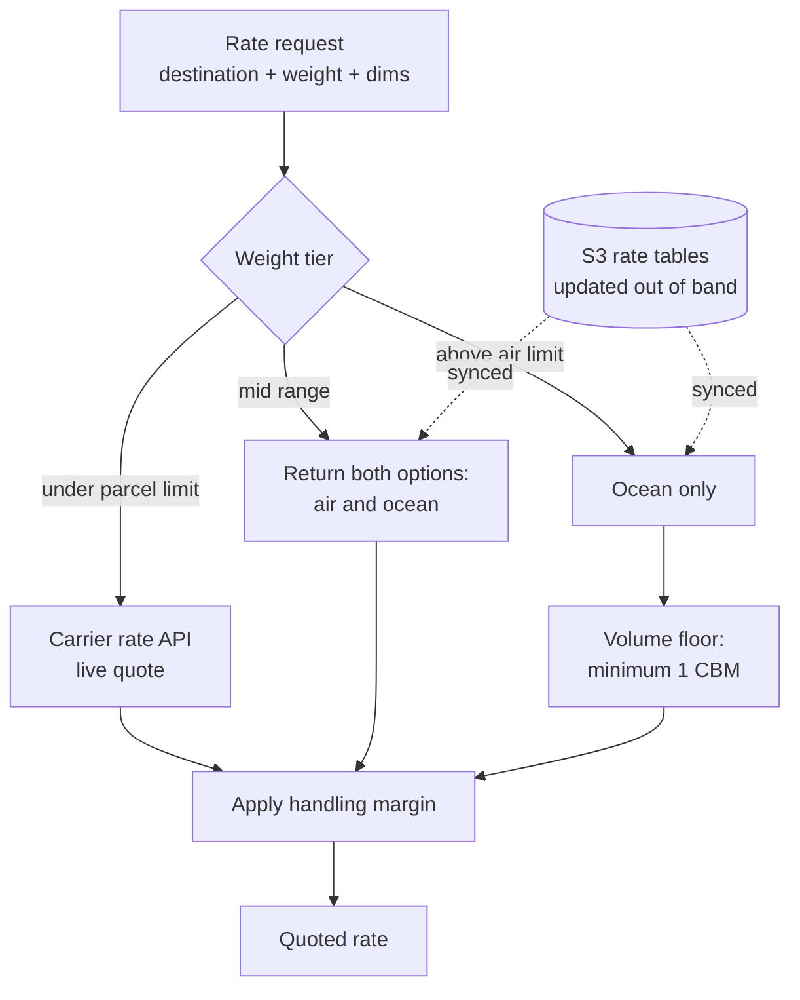

# Freight Quoting Across Weight Tiers

**Trigger** · Request, on the purchase path · **Latency budget** · Customer is waiting · **State** · The only service here with a real schema

## Context

Customers buy raw materials by the drum. An order can be 3 kg of a sample or 900 kg of a base oil, and those two things do not travel the same way: one goes by international parcel, the other goes in a container on a ship.

Checkout, meanwhile, was built for parcels. It expects a shipping cost to be a number that appears quickly.

## Problem

**Three different quoting mechanisms behind one number.** Parcel rates come live from a carrier API. Ocean and air freight come from negotiated rate tables that are updated periodically and are not exposed by any API. The customer sees one shipping line either way.

**The middle tier is a choice, not a calculation.** Between roughly 45 kg and 750 kg, both air and ocean are viable and the tradeoff is money versus weeks. That is the buyer's call, not the system's — so the service has to present both rather than pick.

**Ocean freight is priced by volume, not weight.** Below a full cubic meter you still pay for a full cubic meter. A quote that scales linearly down to zero is wrong in the direction that costs the supplier money on every small shipment.

**Rate tables change out of band.** They arrive as files, updated on the freight forwarder's schedule, not on a deploy schedule.

## Approach

**Weight tier selects the mechanism, and the tier boundaries are configuration.** Carrier parcel limits and forwarder thresholds move. They live in settings, not in comparison operators scattered through the pricing code.

**The middle tier returns options instead of a decision.** The service's job is to know what shipping *costs*; it is not to know whether this particular buyer would rather pay more or wait longer. Returning both and letting the buyer choose also means the quote is explainable — a single number with no visible basis invites a support ticket per order.

**The volume floor is applied before margin, not after.** A minimum billable cubic meter is a property of how ocean freight is sold, so it belongs in the cost, with the handling margin applied on top of the corrected figure. Applying it the other way around silently changes the effective margin on exactly the small shipments where margin matters most.

**Rate tables sync from object storage rather than living in the repo.** New tables are uploaded and picked up; nobody deploys the service to change a price. This is the one service here with real persistent state and schema migrations, because rate data has a lifecycle that outlives any single container.

**Margin is one named setting, applied in one place.** Handling markup is a business decision that gets revisited. It is a single configured multiplier applied at a single point in the pipeline — not folded into a rate table, not duplicated per tier.

## Why this service runs warm

This is the only service in the group that sits directly in the purchase flow with a customer watching. It runs as a container with a fixed worker count rather than anything that can cold-start, and the carrier API call is the one external dependency with a tight timeout — a slow quote must degrade to a fallback, never to a spinner.

---

## 한국어 요약

고객이 원료를 드럼 단위로 삽니다. 주문 하나가 3kg 샘플일 수도 900kg 베이스 오일일 수도 있고, 이 둘은 같은 방식으로 이동하지 않습니다. 하나는 국제 택배로, 다른 하나는 배에 실린 컨테이너로 갑니다. 그런데 체크아웃은 택배 기준으로 만들어져 있고, 배송비란 **빨리 나타나는 숫자 하나**라고 전제합니다.

**어려웠던 지점**

- **숫자 하나 뒤에 견적 메커니즘이 셋.** 택배 요율은 택배사 API에서 실시간으로, 해상·항공 운임은 주기적으로 갱신되는 협상 요율표에서 옵니다(API 없음). 고객에게는 어느 쪽이든 배송비 한 줄로 보입니다.
- **중간 구간은 계산이 아니라 선택입니다.** 대략 45kg~750kg 구간은 항공과 해상이 둘 다 가능하고, 트레이드오프는 **돈 대 몇 주**입니다. 이건 시스템이 아니라 구매자가 결정할 문제라, 서비스는 고르는 게 아니라 둘 다 제시해야 합니다.
- **해상 운임은 중량이 아니라 부피로 매겨집니다.** 1 CBM 미만이어도 1 CBM 요금을 냅니다. 0까지 선형으로 내려가는 견적은 **소량 출하마다 공급사가 손해 보는 방향**으로 틀립니다.
- **요율표는 배포 주기 밖에서 바뀝니다.** 포워더 일정에 맞춰 파일로 옵니다.

**접근**

- **중량 구간이 메커니즘을 고르고, 구간 경계는 설정값입니다.** 택배사 한도와 포워더 임계치는 움직입니다. 가격 로직 여기저기 흩어진 비교 연산자가 아니라 설정에 있어야 합니다.
- **중간 구간은 결정 대신 선택지를 반환합니다.** 서비스의 일은 배송이 **얼마인지** 아는 것이지, 이 구매자가 더 내고 빨리 받을 사람인지 아는 게 아닙니다. 둘 다 주면 견적이 설명 가능해지기도 합니다 — 근거가 안 보이는 숫자 하나는 주문마다 문의 티켓을 부릅니다.
- **부피 하한은 마진 **전에** 적용합니다.** 최소 청구 부피는 해상 운임이 판매되는 방식의 속성이므로 원가에 속하고, 취급 마진은 보정된 값 위에 얹습니다. 순서를 뒤집으면 **하필 마진이 가장 중요한 소량 출하에서** 실질 마진이 조용히 달라집니다.
- **요율표는 레포가 아니라 오브젝트 스토리지에서 동기화.** 새 표를 업로드하면 반영되고, 가격 바꾸자고 서비스를 배포하지 않습니다. 이 그룹에서 유일하게 실제 영속 상태와 스키마 마이그레이션을 가진 서비스인데, 요율 데이터의 수명이 컨테이너 하나보다 길기 때문입니다.
- **마진은 이름 붙은 설정 하나, 적용 지점 하나.** 취급 마크업은 계속 재검토되는 비즈니스 결정입니다. 요율표에 녹여 넣지도, 구간별로 중복시키지도 않습니다.

**이 서비스만 상시 워밍으로 도는 이유** — 이 그룹에서 유일하게 고객이 지켜보는 구매 흐름 한가운데 있습니다. 콜드 스타트가 가능한 형태 대신 워커 수를 고정한 컨테이너로 돌리고, 택배사 API 호출에는 짧은 타임아웃을 겁니다. 느린 견적은 폴백으로 degrade해야지 스피너로 degrade하면 안 됩니다.
