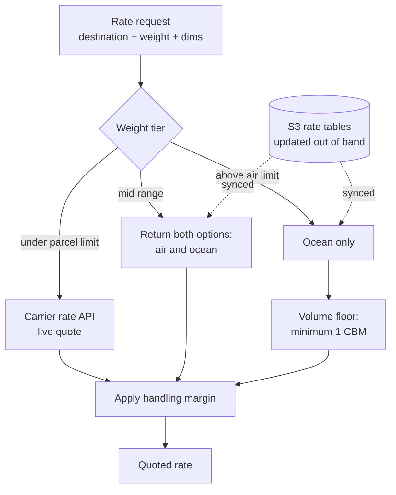

# Freight Quoting Across Weight Tiers

**Trigger** · Request, on the purchase path · **Latency budget** · Customer is waiting · **State** · The only service here with a real schema

## Context

Customers buy raw materials by the drum. An order can be 3 kg of a sample or 900 kg of a base oil, and those two things do not travel the same way: one goes by international parcel, the other goes in a container on a ship.

Checkout, meanwhile, was built for parcels. It expects a shipping cost to be a number that appears quickly.

## Problem

**Three different quoting mechanisms behind one number.** Parcel rates come live from a carrier API. Ocean and air freight come from negotiated rate tables that are updated periodically and are not exposed by any API. The customer sees one shipping line either way.

**The middle tier is a choice, not a calculation.** Between roughly 45 kg and 750 kg, both air and ocean are viable and the tradeoff is money versus weeks. That is the buyer's call, not the system's — so the service has to present both rather than pick.

**Ocean freight is priced by volume, not weight.** Below a full cubic meter you still pay for a full cubic meter. A quote that scales linearly down to zero is wrong in the direction that costs the supplier money on every small shipment.

**Rate tables change out of band.** They arrive as files, updated on the freight forwarder's schedule, not on a deploy schedule.

## Approach

**Weight tier selects the mechanism, and the tier boundaries are configuration.** Carrier parcel limits and forwarder thresholds move. They live in settings, not in comparison operators scattered through the pricing code.

**The middle tier returns options instead of a decision.** The service's job is to know what shipping *costs*; it is not to know whether this particular buyer would rather pay more or wait longer. Returning both and letting the buyer choose also means the quote is explainable — a single number with no visible basis invites a support ticket per order.

**The volume floor is applied before margin, not after.** A minimum billable cubic meter is a property of how ocean freight is sold, so it belongs in the cost, with the handling margin applied on top of the corrected figure. Applying it the other way around silently changes the effective margin on exactly the small shipments where margin matters most.

**Rate tables sync from object storage rather than living in the repo.** New tables are uploaded and picked up; nobody deploys the service to change a price. This is the one service here with real persistent state and schema migrations, because rate data has a lifecycle that outlives any single container.

**Margin is one named setting, applied in one place.** Handling markup is a business decision that gets revisited. It is a single configured multiplier applied at a single point in the pipeline — not folded into a rate table, not duplicated per tier.

## Why this service runs warm

This is the only service in the group that sits directly in the purchase flow with a customer watching. It runs as a container with a fixed worker count rather than anything that can cold-start, and the carrier API call is the one external dependency with a tight timeout — a slow quote must degrade to a fallback, never to a spinner.

---

## 한국어 요약

고객은 원료를 드럼 단위로 삽니다. 주문 하나가 3kg짜리 샘플일 수도, 900kg짜리 베이스 오일일 수도 있는데 이 둘은 이동하는 방식이 아예 다릅니다. 하나는 국제 택배로 가고, 다른 하나는 컨테이너에 실려 배를 탑니다. 그런데 체크아웃은 택배 기준으로 만들어져 있습니다. 배송비란 빨리 뜨는 숫자 하나라고 전제하고 있죠.

**어려웠던 지점**

- **숫자 하나 뒤에 견적 메커니즘이 셋.** 택배 요율은 택배사 API에서 실시간으로 받아오고, 해상과 항공 운임은 주기적으로 갱신되는 협상 요율표에서 가져옵니다(이쪽은 API가 없습니다). 고객 화면에는 어느 쪽이든 배송비 한 줄로 나옵니다.
- **중간 구간은 계산이 아니라 선택입니다.** 대략 45kg에서 750kg 사이는 항공과 해상이 둘 다 가능하고, 돈을 더 쓰느냐 몇 주를 더 기다리느냐의 문제가 됩니다. 시스템이 아니라 구매자가 정할 일이라, 서비스는 하나를 고르는 대신 둘 다 내놓습니다.
- **해상 운임은 중량이 아니라 부피로 매겨집니다.** 1 CBM이 안 돼도 1 CBM 요금을 냅니다. 0까지 선형으로 내려가는 견적은 소량 출하마다 공급사가 손해 보는 쪽으로 틀립니다.
- **요율표는 배포 주기와 무관하게 바뀝니다.** 포워더 일정에 맞춰 파일로 날아옵니다.

**접근**

- **중량 구간이 메커니즘을 고르고, 구간 경계는 설정값으로 뒀습니다.** 택배사 한도와 포워더 임계치는 계속 움직입니다. 가격 로직 여기저기 박힌 비교 연산자가 아니라 설정에 있어야 하는 값입니다.
- **중간 구간은 결정 대신 선택지를 돌려줍니다.** 서비스가 알아야 할 건 배송이 얼마인지지, 이 구매자가 더 내고 빨리 받을 사람인지가 아닙니다. 둘 다 보여주면 견적을 설명할 수 있게 되는 이점도 있습니다. 근거가 안 보이는 숫자 하나는 주문마다 문의 티켓을 부릅니다.
- **부피 하한은 마진보다 먼저 적용합니다.** 최소 청구 부피는 해상 운임을 파는 방식 자체에 딸린 성질이라 원가에 들어가고, 취급 마진은 그렇게 보정된 값 위에 얹습니다. 순서를 뒤집으면 하필 마진이 제일 중요한 소량 출하에서 실질 마진이 슬쩍 달라집니다.
- **요율표는 레포가 아니라 오브젝트 스토리지에서 동기화합니다.** 새 표를 올리면 반영되고, 가격 바꾸자고 서비스를 배포할 일은 없습니다. 이 그룹에서 실제 영속 상태와 스키마 마이그레이션을 가진 서비스는 여기뿐인데, 요율 데이터가 컨테이너 하나보다 오래 살기 때문입니다.
- **마진은 이름 붙인 설정 하나, 적용 지점 하나.** 취급 마크업은 계속 다시 들여다보게 되는 비즈니스 결정입니다. 요율표에 녹여 넣지도 않고 구간마다 중복해두지도 않았습니다.

**이 서비스만 상시 워밍으로 도는 이유** — 이 그룹에서 고객이 지켜보는 구매 흐름 한가운데 있는 건 여기뿐입니다. 콜드 스타트가 생길 수 있는 형태 대신 워커 수를 고정한 컨테이너로 돌리고, 택배사 API 호출에는 짧은 타임아웃을 겁니다. 견적이 느릴 때 폴백으로 떨어져야지 스피너로 떨어지면 안 되니까요.
