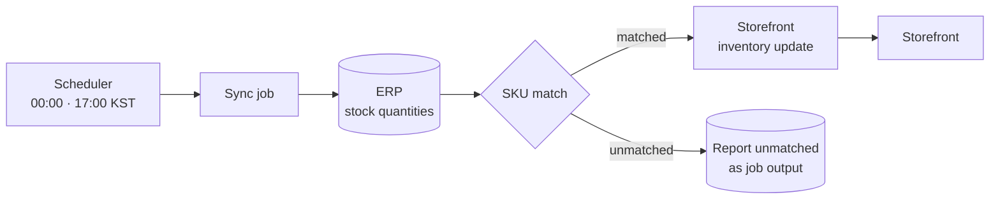

# Scheduled Inventory Sync

**Trigger** · Schedule, twice daily · **Direction** · ERP → storefront · **Shape** · A CLI job, not a server

## Context

Stock exists in two places. The ERP knows what is physically in the warehouse, because it is also what the offline sales team, the production floor, and the accountants use. The storefront shows a number to customers.

Only one of those can be the truth. It is the ERP.

## Problem

**SKU is the join key, and the two systems disagree about it.** The ERP has its own material codes, built up over years, with formatting conventions that predate the store. The storefront has variant SKUs. Matching them is not a string comparison, and any material that fails to match is a product whose stock silently never updates.

**Overstating stock is much worse than understating it.** Selling something that isn't there means calling a manufacturing customer to tell them their raw material shipment is delayed. Showing less than you have costs a sale you might not have made anyway. The sync's error behavior should be asymmetric.

**Two updates a day is a deliberate staleness budget.** Real-time inventory sync from an ERP means either polling it constantly or asking it to push, and this ERP does neither comfortably. For materials with long production lead times and B2B order cycles measured in weeks, a stock figure that is a few hours old is accurate enough — and admitting that in the design is better than pretending otherwise with a fragile near-real-time pipeline.

## Approach

**It is a scheduled job, not a service.** No HTTP surface, no idle pods, no health endpoint pretending to mean something. It starts, reconciles, reports, and exits. The failure mode of a job that didn't run is far easier to detect than a service that is up but has quietly stopped doing its work.

**Unmatched SKUs are output, not warnings.** Every material the job could not map is reported as part of the run's result. An unmatched SKU is a product page showing a stale number to a customer — it is a data problem someone has to fix in one of the two systems, and it stays visible until they do.

**Run times chosen around the business, not around load.** Just after midnight to reflect the previous day's closing position, and late afternoon to catch the day's movements before evening ordering. Both are outside the window when warehouse staff are actively adjusting quantities, so the job reads a settled figure rather than a moving one.

**The job is idempotent by construction.** It reads current ERP quantities and sets storefront levels to match. It does not apply deltas. A re-run after a partial failure converges to the same state instead of double-counting, which means "just run it again" is always a safe response.

## What I would revisit

The twice-daily cadence is right for the ordering rhythm, but the window between runs is exactly where an oversell happens — a large order in the morning isn't reflected until evening. Consuming order webhooks to decrement locally between full syncs would close it, with the scheduled run continuing to serve as the authoritative reconciliation. That is the standard pattern: a fast approximate path plus a slow authoritative one, where the slow path is the arbiter.

---

## 한국어 요약

재고는 두 곳에 있습니다. ERP는 창고에 실제로 뭐가 몇 개 있는지 압니다. 오프라인 영업팀도, 생산 현장도, 회계도 같은 걸 보고 있으니까요. 스토어프론트는 고객에게 숫자를 보여줍니다. 둘 중 하나만 진실일 수 있는데, 그건 ERP입니다.

**어려웠던 지점**

- **SKU가 조인 키인데 두 시스템의 말이 다릅니다.** ERP에는 스토어보다 오래된 표기 관행을 따라 수년간 쌓인 자체 품목 코드가 있고, 스토어프론트에는 변형(variant) SKU가 있습니다. 문자열 비교로는 안 맞고, 매칭에 실패한 품목은 재고가 영영 갱신되지 않는 상품이 됩니다. 그것도 아무 소리 없이요.
- **재고를 많게 보여주는 게 적게 보여주는 것보다 훨씬 나쁩니다.** 없는 걸 팔면 제조사 고객에게 전화해서 원료 입고가 늦어진다고 말해야 합니다. 있는 것보다 적게 보여주면 어차피 안 났을지도 모를 판매 하나를 놓칠 뿐입니다. 동기화가 틀릴 때의 동작은 한쪽으로 기울어 있어야 합니다.
- **하루 두 번은 일부러 잡은 staleness 예산입니다.** ERP에서 실시간으로 재고를 맞추려면 계속 폴링하거나 ERP가 푸시해줘야 하는데, 이 ERP는 둘 다 편하게 해주지 않습니다. 생산 리드타임이 길고 B2B 주문 주기가 주 단위인 원료라면 몇 시간 지난 재고 숫자로도 충분히 정확합니다. 그걸 설계에서 인정하는 편이 취약한 준실시간 파이프라인으로 아닌 척하는 것보다 낫습니다.

**접근**

- **서비스가 아니라 스케줄 잡입니다.** HTTP 표면도 없고, 놀고 있는 파드도 없고, 의미 있는 척하는 헬스 엔드포인트도 없습니다. 시작해서 대사하고 리포트를 남기고 끝납니다. 안 돌아간 잡은 떠 있으면서 조용히 일을 안 하는 서비스보다 훨씬 알아채기 쉽습니다.
- **매칭 실패한 SKU는 경고가 아니라 산출물입니다.** 매핑하지 못한 품목을 전부 실행 결과에 담아 보고합니다. 매칭이 안 된 SKU는 곧 고객에게 낡은 숫자를 보여주고 있는 상품 페이지이고, 두 시스템 중 한쪽에서 사람이 손봐야 하는 데이터 문제입니다. 고칠 때까지 계속 결과에 남습니다.
- **실행 시각은 부하가 아니라 업무 리듬에 맞췄습니다.** 자정 직후에 한 번 돌려 전일 마감을 반영하고, 늦은 오후에 한 번 더 돌려 당일 변동을 저녁 주문 전에 반영합니다. 둘 다 창고 인력이 수량을 한창 조정하는 시간대를 피한 시각이라, 움직이는 값이 아니라 정착된 값을 읽습니다.
- **구조적으로 멱등합니다.** ERP의 현재 수량을 읽어서 스토어프론트 레벨을 그 값으로 설정합니다. 증감(delta)을 적용하지 않습니다. 부분 실패 후에 다시 돌려도 중복 반영 없이 같은 상태로 수렴하니, "그냥 다시 돌리세요"가 늘 안전한 답이 됩니다.

**다시 한다면** — 하루 두 번이라는 주기는 주문 리듬에 맞지만, 실행 사이의 간격이 바로 oversell이 나는 구간입니다. 오전에 들어온 대량 주문이 저녁까지 반영되지 않으니까요. 주문 웹훅을 받아 전체 동기화 사이에 로컬에서 차감해두면 이 구멍이 닫히고, 스케줄 실행은 그대로 권위 있는 대사 역할을 합니다. 흔한 패턴입니다. 빠르지만 근사한 경로와 느리지만 권위 있는 경로를 같이 두고, 최종 판정은 느린 쪽에 맡기는 겁니다.
